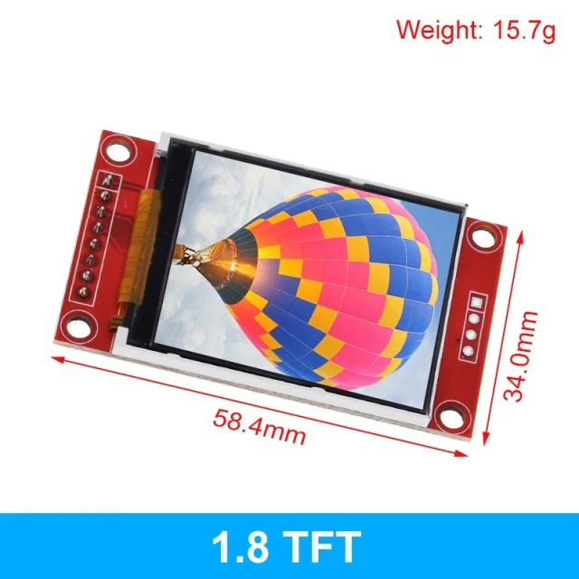
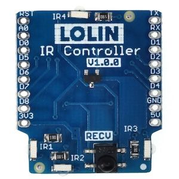

Flashing ESPHome devices
==========

Preamble
----------

Many off-the-shelf devices are powered with ESP8285 or ESP8266 chips, in devices with white-label
firmware provided by a company called Tuya. The project [tuya-convert](https://github.com/ct-Open-Source/tuya-convert)
exists to hack these devices and enable us to load custom firmware.

Firmware options include:

 * Tasmota - the original; many devices are known and pin configurations [listed here](https://templates.blakadder.com/)
 * Espurna - an alternative which has a nice Web UI and is easily configurable with custom builds
 * **ESP Home** - a versetile firmware which supports a lot of different chips in practice, and has many
   great features for the advanced user

I use [ESP Home](https://esphome.io/) both for NodeMCU type ESP8266 boards, and for off-the-shelf
devices running Tuya.


My Devices
----------

|ID|Type|Manufacturer|Model|Source|
|--|----|------------|-----|------|
|ea9c90|Plug Switch|Kogan SmarterHome|Smart Plug with Energy Meter|kogan.com|
|040cab|Plug Switch|Kogan SmarterHome|Smart Plug with Energy Meter|kogan.com|
|047c60|Plug Switch|Kogan SmarterHome|Smart Plug with Energy Meter|kogan.com|
|6c7fe7|Light|Kogan SmarterHome|RGBWW|kogan.com|
|6c8595|Light|Kogan SmarterHome|RGBWW|kogan.com|
|c05775|Plug Switch|Smart Connect|PC189HA|Bunnings|
|92d0f9|Plug Switch|Smart Connect|PC189HA|Bunnings|
|f58f91|4x Plug Switch|Smart Connect|PB89HA|Bunnings|
|10945b|ESP8622|Generic|NodeMCUv2|Aliexpress|
|774ba4|ESP8622|Generic|NodeMCUv2|Aliexpress|
|707a3c|ESP32|Wemos|LOLIN D32|Aliexpress|


Process
----------

 0. Extract the ID for the above table using `esptool.py`, as specified [below](#id-field)
 1. [Configure a custom image using the esphome templates](#template)
 2. [Build the custom image](#build)
 3. For store-bought devices, use [`tuya-convert`](#tuya-convert) to do the initial hack, flashing the binary built previously
 4. Ensure device appears on wifi network
 5. Update "My Devices" table in this `README.md`
 6. Setup esphome config and re-flash to esphome


### ID Field

The `id` for a given device is the last 6 chars of its MAC address. One can retrieve the MAC by
attaching the device via USB and running:

```
esptool.py flash_id | grep MAC | cut -d : -f 5-7
```

ESP Home
----------

### Template

Templates for different devices are in the [`templates`](./templates) directory. These can be
composed together when multiple I/O devices are attached to a single ESP. It's trivial to create
new templates from the [ESP Home docs](https://esphome.io/index.html).

The `render` script outputs a file to feed `esphome`:

```
render 774ba4 192.168.20.52  esp8266 'ESP8622 2' dht22 temt6000 --room 'Baby Bedroom'
```

CLI options are as follows:

```
Usage: render [OPTIONS] DEVICE_ID DEVICE_IP DEVICE_TYPE NAME [TEMPLATES]...

  Render a set of templates as an ESPHome configuration.

  DEVICE_ID  Unique identifier for this ESP
  DEVICE_IP  Static IP on your LAN for this ESP
  DEVICE_TYPE  PlatformIO platform/board combination. One of lolin,lolin_pro,esp32,esp8266,esp8285
  NAME         Friendly device name, which will show in HA
  TEMPLATES    List of templates to render

Options:
  --room TEXT     Name of the room for this sensor
  --address TEXT  Sensor address
  --help          Show this message and exit.
```


### Build

A `Makefile` is included to simplify usage across many ESPs.

Render the template configured for device `c0a4ba`, and build the firmware binary:

    DEVICE=c0a4ba make compile

Under the hood, this calls esphome `compile` command:

    esphome compile build/device_10945b.yaml


### Initial flash with esptool


```
> esptool.py --before default_reset --after hard_reset --baud 460800 --chip esp8266 write_flash 0x0 774ba4/.pioenvs/774ba4/firmware.bin
esptool.py v2.8
Serial port /dev/ttyUSB0
Connecting....
Detecting chip type... ESP8266
Chip is ESP8266EX
Features: WiFi
Crystal is 26MHz
MAC: 84:f3:eb:c0:a4:b4
Uploading stub...
Running stub...
Stub running...
Configuring flash size...
Compressed 433552 bytes to 315828...
Wrote 433552 bytes (315828 compressed) at 0x00000000 in 28.8 seconds (effective 120.5 kbit/s)...
Hash of data verified.

Leaving...
Hard resetting via RTS pin...
```

### OTA flash

Once a device has been flashed to ESP Home, one can update directly from the CLI via OTA on the
network. If that is failing, switch to flash via USB.

    DEVICE=c0a4ba make upload


Devices
---------

Notes on devices to use with ESP32/ESP8266.


## SSD1306

 * [ESPHome component](https://esphome.io/components/display/ssd1306.html)
 * [ESPHome template](./templates/display/ssd1306_i2c.tmpl)

Pin configuration for an OLED [128x64 display](https://www.adafruit.com/product/326).
These can run on either i2c or SPI bus; this configuration uses i2c.

From the screen-side, pins left-to-right:

 1. `Data` - i2c data pin, or SPI MOSI
 2. `Clk` - SPI clock
 3. `SA0` - Select Address / Data Command (aka `DC`)
 4. `Rst` - Reset
 5. `CS` - SPI chip select
 6. `3v3` - 3.3v input
 7. `Vin`
 8. `Gnd`

Required pin config from the [ST7735 esphome.io doc](https://esphome.io/components/display/st7735.html):

```
spi:
  clk_pin: 25
  mosi_pin: 26

display:
  - platform: st7735
    reset_pin: 21
    cs_pin: 22
    dc_pin: 23
```


## ST7735

_[`st7735.tmpl`](./templates/display/st7735.tmpl)_

[ST7735](https://esphome.io/components/display/st7735.html) display driver configuration, for use
with a TZT 1.8" [TFT 160x128 display](https://www.aliexpress.com/item/4000219159401.html).



From the screen-side, pins left-to-right:

 1. `LED` - Connect to 3v or 5v
 2. `SCK` - SPI clock (aka `CLK`)
 3. `SDA` - Bus input (aka SPI `MOSI`)
 4. `A0` - Address Select / Data Command (aka `DC`)
 5. `RESET`
 6. `CS`
 7. `GND`
 8. `VCC`

Required pin config from the [ST7735 esphome.io doc](https://esphome.io/components/display/st7735.html):

```
spi:
  clk_pin: 25
  mosi_pin: 26

display:
  - platform: st7735
    reset_pin: 21
    cs_pin: 22
    dc_pin: 23
```

## LOLIN IR

_[`Infrared`](https://esphome.io/components/remote_transmitter.html#remote-setting-up-infrared)_

The [Wemos IR shield](https://www.wemos.cc/en/latest/d1_mini_shield/ir.html) is transmitter and
receiver in one convenient board. It also has an LED to show when IR signals are being sent.



||Pin|GPIO|
|-|-|-|
|Send|D3|0|
|Recv|D4|2|


## LOLIN D32 Pro TFT

The LOLIN D32 Pro has a TFT connector, as does the I2C/TFT hat. The pinout for this connector
follows. The colours correspond to the 10 pin TFT connector cable that fits the LOLIN.


 1. `TS_CS` / `IO12` (black) - Touchscreen SPI chip select
 2. `TFT_CS` / `IO14` (red) - TFT SPI chip select
 3. `3V3` (white)
 4. `SCK` / `IO18` (yellow) - SPI clock (aka `CLK`)
 5. `MISO` / `IO19` (orange) - SPI input
 6. `MOSI` / `IO23` (green) - SPI output (aka `SDA`)
 7. `TFT_DC` / `IO27` (blue) - Data Command (aka `DC`) / Address Select
 8. `TFT_RST` / `IO33` (purple) - TFT Reset
 9. `GND` (grey)
 10. `TFT_LED` / `IO32` (brown) - Connect to 3v or 5v


## DS18B20

_[`ds18b20.tmpl`](./templates/ds18b20.tmpl)_

[Dallas](https://esphome.io/components/sensor/dallas.html) 1-wire protocol temperature sensors, such
as the DS18B20.

These are fast to read, and are fully enclosed and therefore safe outdoors.

Many sensors can be put on the same data line (hence "1-wire protocol"); each device is identified
by a hexidecimal address, which esphome will print on startup when it scans the Dallas bus. 

For indoors usage, the DHT22 is preferred as no circuit is required - the DHT22 pins attach directly
the ESP board. The exception is the Raspberry Pi - DHT22 support is terrible (the Adafruit
libraries), so preference is to use the [`w1thermsensor`](https://github.com/timofurrer/w1thermsensor)
project as in [mafrosis/w1therm](https://github.com/mafrosis/w1therm).

```
┌──────────────────┐
│ DS18B20          │
│                  │
│ RED YELLOW BLACK │
└──────────────────┘
   │    │     │
   │    │     │
   │    │     │
┌─────────┐   │
│ 2.2k R  │   └┐
└─────────┘    │
   │    │      │
   │    │      │
   │    │      │

  3V    D5    GND
```
