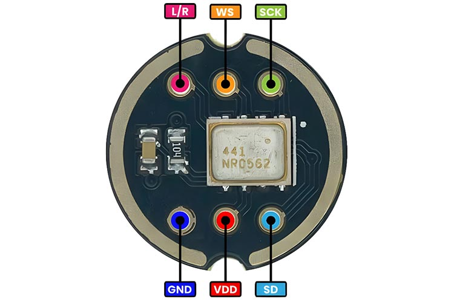
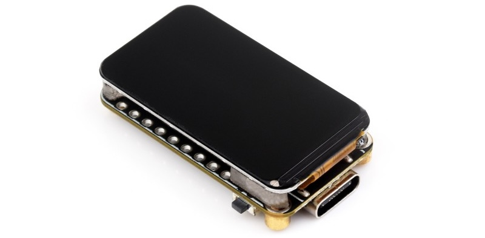
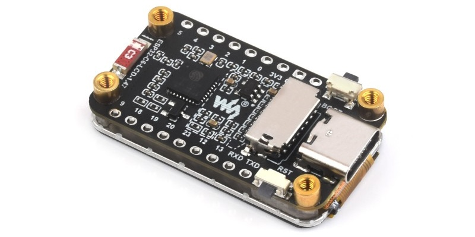
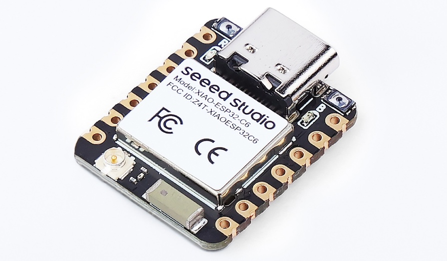
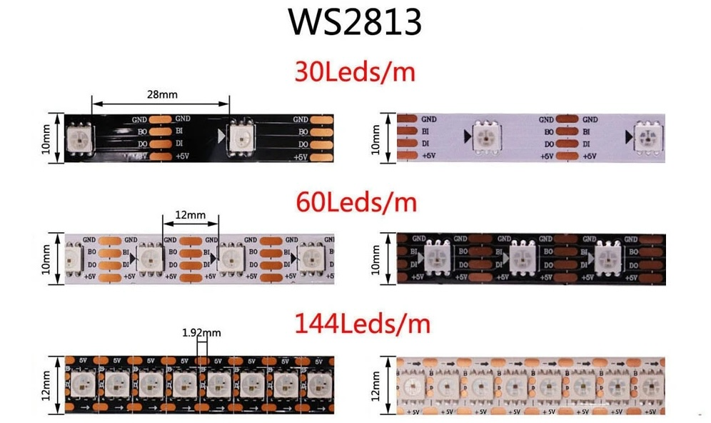
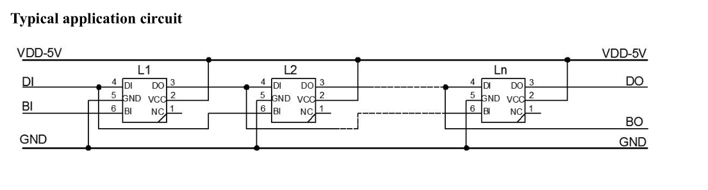
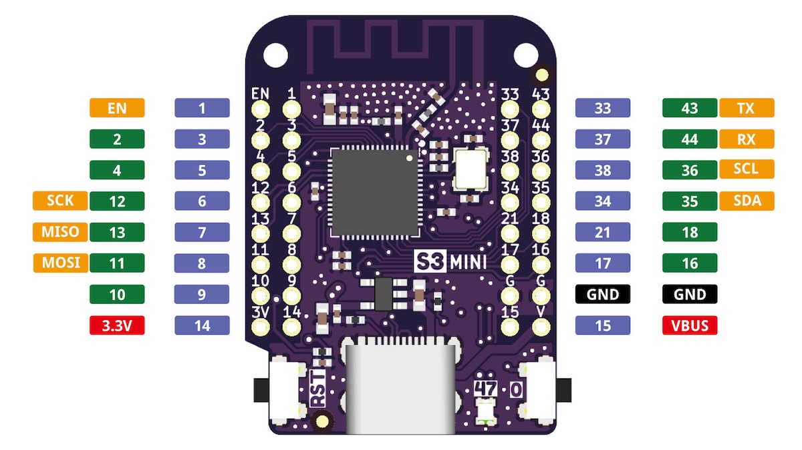
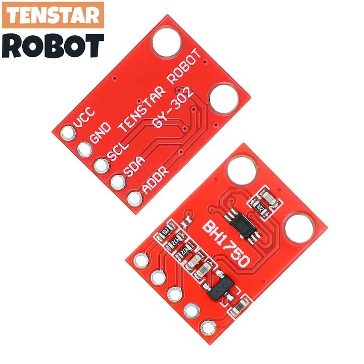

Flashing ESPHome devices
==========

Preamble
----------

Many off-the-shelf devices are powered with ESP8285 or ESP8266 chips, in devices with white-label
firmware provided by a company called Tuya. The project [tuya-convert](https://github.com/ct-Open-Source/tuya-convert)
exists to hack these devices and enable us to load custom firmware.

Firmware options include:

 * Tasmota - the original; many devices are known and pin configurations [listed here](https://templates.blakadder.com/)
 * Espurna - an alternative which has a nice Web UI and is easily configurable with custom builds
 * **ESP Home** - a versetile firmware which supports a lot of different chips in practice, and has many
   great features for the advanced user

I use [ESP Home](https://esphome.io/) both for NodeMCU type ESP8266 boards, and for off-the-shelf
devices running Tuya.


How
----------

How to flash a device with this repo.

 0. Extract the ID for the above table using `make flash`
 1. [Configure a custom image using the esphome templates](#template)
 2. [Build the custom image](#build)
 3. Flash and ensure device appears on wifi network
 4. Watch the MQTT logs using `DEVICE=blah make logs`


ESP Home
----------

### Template

Use [esphome templating](https://esphome.io/guides/configuration-types#packages-as-templates) to
create a template for the device. Ensure to import the `_esphome.yaml` package, which has the
common configuration, and also the sensor packages for your use-case.

An example device YAML:
```
---
substitutions:
  device_id: '0fe8ed'
  device_name: 'ESP8622 Server Closet'
  static_ip: '192.168.20.63'

esp8266:
  board: nodemcuv2

packages:
  base: !include ../packages/_esphome.yaml
  dht22: !include
    file: ../packages/dht22.yaml
    vars:
      room: 'Server Closet'
      data_pin: 1
```


### Build

A `Makefile` is included to simplify the interface.

Render the template configured for device `c0a4ba`, and build the firmware binary:

    DEVICE=c0a4ba make compile

Under the hood, this calls esphome `compile` command:

    esphome compile templates/10945b.yaml


### Initial flash with esptool

```
> esptool.py --before default_reset --after hard_reset --baud 460800 --chip esp8266 write_flash 0x0 774ba4/.pioenvs/774ba4/firmware.bin
esptool.py v2.8
Serial port /dev/ttyUSB0
Connecting....
Detecting chip type... ESP8266
Chip is ESP8266EX
Features: WiFi
Crystal is 26MHz
MAC: 84:f3:eb:c0:a4:b4
Uploading stub...
Running stub...
Stub running...
Configuring flash size...
Compressed 433552 bytes to 315828...
Wrote 433552 bytes (315828 compressed) at 0x00000000 in 28.8 seconds (effective 120.5 kbit/s)...
Hash of data verified.

Leaving...
Hard resetting via RTS pin...
```

### OTA flash

Once a device has been flashed to ESP Home, one can update directly from the CLI via OTA on the
network. If that is failing, switch to flash via USB.

    DEVICE=c0a4ba make upload

#### Changing a device IP address

Leverage the `use_address` attribute on ESPHome's wifi component to connect to a specific IP for the
OTA update.

For example, moving a device from `192.168.20.64` to `192.168.20.205`:

```
---
substitutions:
  device_id: '776b6e'
  device_name: 'ESP8266 Bread Chamber'
  static_ip: '192.168.20.205'

esp8266:
  board: nodemcuv2

packages:
  base: !include
    file: ../packages/_esphome.yaml
    vars:
      use_address: '192.168.20.64'
```


Components
---------

Notes and pinouts for various components I've used with ESP32/ESP8266.


## SSD1306

 * [ESPHome component](https://esphome.io/components/display/ssd1306.html)
 * [ESPHome template](./templates/display/ssd1306_i2c.tmpl)

Pin configuration for an OLED [128x64 display](https://www.adafruit.com/product/326).
These can run on either i2c or SPI bus; this configuration uses i2c.

From the screen-side, pins left-to-right:

 1. `Data` - i2c data pin, or SPI MOSI
 2. `Clk` - SPI clock
 3. `SA0` - Select Address / Data Command (aka `DC`)
 4. `Rst` - Reset
 5. `CS` - SPI chip select
 6. `3v3` - 3.3v input
 7. `Vin`
 8. `Gnd`

Required pin config from the [ST7735 esphome.io doc](https://esphome.io/components/display/st7735.html):

```
spi:
  clk_pin: 25
  mosi_pin: 26

display:
  - platform: st7735
    reset_pin: 21
    cs_pin: 22
    dc_pin: 23
```


## ST7735 display

_[`st7735.tmpl`](./templates/display/st7735.tmpl)_

[ST7735](https://esphome.io/components/display/st7735.html) display driver configuration, for use
with a TZT 1.8" [TFT 160x128 display](https://www.aliexpress.com/item/4000219159401.html).


From the screen-side, pins left-to-right:

 1. `LED` - Connect to 3v or 5v
 2. `SCK` - SPI clock (aka `CLK`)
 3. `SDA` - Bus input (aka SPI `MOSI`)
 4. `A0` - Address Select / Data Command (aka `DC`)
 5. `RESET`
 6. `CS`
 7. `GND`
 8. `VCC`

Required pin config from the [ST7735 esphome.io doc](https://esphome.io/components/display/st7735.html):

```
spi:
  clk_pin: 25
  mosi_pin: 26

display:
  - platform: st7735
    reset_pin: 21
    cs_pin: 22
    dc_pin: 23
```


## LOLIN IR

_[`Infrared`](https://esphome.io/components/remote_transmitter.html#remote-setting-up-infrared)_

The [Wemos IR shield](https://www.wemos.cc/en/latest/d1_mini_shield/ir.html) is transmitter and
receiver in one convenient board. It also has an LED to show when IR signals are being sent.


||Pin|GPIO|
|-|-|-|
|Send|D3|0|
|Recv|D4|2|


## LOLIN D32 Pro TFT

The LOLIN D32 Pro has a TFT connector, as does the I2C/TFT hat. The pinout for this connector
follows. The colours correspond to the 10 pin TFT connector cable that fits the LOLIN.


|   |Colour |Name     |Pin   |Desc|
|-  |-      |-        |-     |-   |
|1  |Black  |`TFT_LED`|`IO32`|Connect to 3v or 5v|
|2  |Red    |`GND`    |      ||
|3  |White  |`TFT_RST`|`IO33`|TFT Reset|
|4  |Yellow |`TFT_DC` |`IO27`|Data Command (aka `DC`) / Address Select (aka `A0`)|
|5  |Orange |`MOSI`   |`IO23`|SPI input (aka `SDA`)|
|6  |Green  |`MISO`   |`IO19`|SPI output|
|7  |Blue   |`SCK`    |`IO18`|SPI clock (aka `CLK`)|
|8  |Purple |`3V3`    |      |aka `VCC`|
|9  |Grey   |`TFT_CS` |`IO14`|TFT SPI chip select|
|10 |Brown  |`TS_CS`  |`IO12`|Touchscreen SPI chip select|


|   |Colour |Name     |Pin   |Desc|
|-  |-      |-        |-     |-   |
|1  |Brown  |`TS_CS`  |`IO12`|Touchscreen SPI chip select|
|2  |Grey   |`TFT_CS` |`IO14`|TFT SPI chip select|
|3  |Purple |`3V3`    |      |aka `VCC`|
|4  |Blue   |`SCK`    |`IO18`|SPI clock (aka `CLK`)|
|5  |Green  |`MISO`   |`IO19`|SPI output|
|6  |Orange |`MOSI`   |`IO23`|SPI input (aka `SDA`)|
|7  |Yellow |`TFT_DC` |`IO27`|Data Command (aka `DC`) / Address Select (aka `A0`)|
|8  |White  |`TFT_RST`|`IO33`|TFT Reset|
|9  |Red    |`GND`    |      ||
|10 |Black  |`TFT_LED`|`IO32`|Connect to 3v or 5v|


## DS18B20 one-wire temp sensor

_[`ds18b20.tmpl`](./templates/ds18b20.tmpl)_

[Dallas](https://esphome.io/components/sensor/dallas.html) 1-wire protocol temperature sensors, such
as the DS18B20.

These are fast to read, and are fully enclosed and therefore safe outdoors.

Many sensors can be put on the same data line (hence "1-wire protocol"); each device is identified
by a hexidecimal address, which esphome will print on startup when it scans the Dallas bus.

For indoors usage, the DHT22 is preferred as no circuit is required - the DHT22 pins attach directly
the ESP board. The exception is the Raspberry Pi - DHT22 support is terrible (the Adafruit
libraries), so preference is to use the [`w1thermsensor`](https://github.com/timofurrer/w1thermsensor)
project as in [mafrosis/w1therm](https://github.com/mafrosis/w1therm).

```
┌───────────────┐
│ DS18B20       │
│               │
│ RED  YEL  BLK │
└───────────────┘
   │    │    │
   │    │    │
   │    │    │
┌─────────┐  │
│ 2.2k R  │  └┐
└─────────┘   │
   │    │     │
   │    │     │
   │    │     │

  3V    D5   GND
```


## Battery

```
mosquitto_pub -h 192.168.1.198 -m 'ON' -t 707a3c/ota_mode -r
```


## Mitsubishi Aircon Unit

_[`mitsubishiheatpump.tmpl`](./templates/mitsubishiheatpump.tmpl)_

The [`SwiCago/HeatPump`](https://github.com/SwiCago/HeatPump) project made it possible to control
Mitsubishi aircon units via serial, on a connector named `CN105`. A kind soul wrapped this library
in esphome, as found at [`geoffdavis/esphome-mitsubishiheatpump`](https://github.com/geoffdavis/esphome-mitsubishiheatpump).

This usage of the library has been done with the ESP8266 [Wemos D1 mini v3.1](https://www.wemos.cc/en/latest/d1/d1_mini_3.1.0.html) as the control board.

Wiring per the [demo circuit](https://github.com/SwiCago/HeatPump/blob/master/README.md#demo-circuit):

```
┌────────┐              ┌───────────┐
│ CN105  │              │ Wemos D1  │
│        ├─┐            │           │
│ 1  12V │x│     ┌──────┤ 5V    3V3 │
│ 2  GND │-├─────┼──────┤ GND    D8 │
│ 3  5V  │-├─────┘      │ D4     D7 │
│ 4  TX  │-├─────┐      │ D3     D6 │
│ 5  RX  │-├───┐ │      │ D2     D5 │
│        ├─┘   │ │      │ D1     D0 │
│        │     │ └──────┤ RX     A0 │
└────────┘     └────────┤ TX    RST │
                        │           │
                        └───────────┘
GND  black   brown
5V   yellow  red
TX   green   orange
RX   blue    yellow
```

## TEMT6000 light sensor

https://www.freetronics.com.au/products/light-sensor-module
https://cdn.shopify.com/s/files/1/0045/8932/files/TEMT6000.pdf

```
┌─┬───┬┬───┬┬───┬─┐
│ │GND││DAT││VCC│ │
│ └───┘└───┘└───┘ │
│      ┌───┐      │
│ .    └───┘    . │
│( )           ( )│
└─'─────────────'─┘
```


## INMP441 I2S microphone




```
L/R  left/right channel (needs to be grounded not floating)
WS   i2s word select
SCK  i2s clock
SD   i2s data
VCC  3.3V
GND  ground
```


## Waveshare C6 1.47" LCD




https://www.waveshare.com/wiki/ESP32-C6-LCD-1.47

```
      ┌─────┐
┌─────┤     ├─────┐
├─┐   │     │   ┌─┤
│ │   └─────┘   │ │
├─┘             └─┤
│                 │
│5V            TXD│
│GND           RXD│
│3V3            13│
│0              12│
│1              23│
│2    ┌─────┐   20│
│3    │     │   19│
│4    │     │   18│
│5    └─────┘    9│
│                 │
└─────────────────┘
```

### Quirks

The ESP-C6 is a single core SOC, which means wifi and sensor reading must share a core. Make sure any sensor read intervals are long enough not to overload the CPU.


## Seeed XIAO C6



https://wiki.seeedstudio.com/xiao_esp32c6_getting_started/

```
      ┌─────┐
┌┬─┬──┤     ├──┬─┬┐
│└─┘  │     │  └─┘│
│D0   └─────┘   5V│
│D1            GND│
│D2  ┌───────┐ 3V3│
│D3  │       │ D10│
│D4  │       │  D9│
│D5  │       │  D8│
│D6  └───────┘  D7│
└─────────────────┘
```


## Zigbee


## WS2813 LED strip



```
GND  white
5V   red
DI   green
BI   blue
```

The two data pins are for primary data and backup data. Only the primary `DI` needs to be connected to the ESP controller. The backup connector links each LED with the next-but-one, if the LED strip is cut and reconnected then all four wires must be connected.

Supplied wires are AWG22 gauge with 2.54mm pitch connectors.

### Power

A run of 100 LEDs at 100% brightness can draw a large amount of power - nearly 3 amps at 5V in testing. According to the spec, power requirement is 18 watts per metre.

Really long runs need to have power injected along the LED strip:



### Quirks

Using `neopixelplus` requires the ESP8266 GPIO3 pin. On the Wemos D1 mini this is labelled `RX`.


## Lolin S3 Mini



https://www.wemos.cc/en/latest/s3/s3_mini.html


## BH1750 Light sensor

_[`bh1750.tmpl`](./packages/bh1750.yaml)_



```
┌─.───────────────┐
│( )          3.3V│
│ '    ┌─┐     GND│
│      │ │     SCL│
│ .    └─┘     SDA│
│( )          ADDR│
└─'───────────────┘
```

Operates in range 3V-5V.

The ADDR pin enables two of these to be operated on the same i2c bus. Pull the pin high/low to differentiate the address.

```
High 0x5C
Low 0x23
```


## HTU21d Temp sensor


